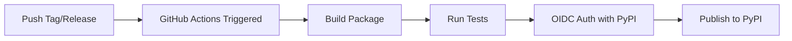

# Automated Publishing Setup with GitHub Actions + PyPI Trusted Publishers

This guide will help you set up automated publishing to PyPI using GitHub Actions and PyPI's Trusted Publishers feature (the modern best practice).

## Why This Approach is Better

✅ **No API tokens to manage** - Uses OIDC authentication  
✅ **More secure** - Short-lived tokens, can't be leaked  
✅ **Automated** - Publishes automatically on releases  
✅ **Professional** - Standard practice for serious Python packages  
✅ **Audit trail** - Clear history of all publications  

## Step-by-Step Setup

### 1. Create GitHub Repository

```bash
# Create a new repository on GitHub called "lidar_beam_reduction"
# Then clone and set it up:

git clone https://github.com/yourusername/lidar_beam_reduction.git
cd lidar_beam_reduction

# Copy all files from the standalone directory
cp -r /home/roboticslab/code/Licode/PointPillars/lidar_beam_reduction/lidar_beam_reduction_standalone/* .

# Initial commit
git add .
git commit -m "Initial commit: LiDAR beam reduction package"
git push origin main
```

### 2. Configure PyPI Trusted Publisher

1. **Go to PyPI**: https://pypi.org/account/login/
2. **Navigate to**: "Your account" → "Publishing" → "Add a new pending publisher"
3. **Fill in the form**:
   - **PyPI project name**: `lidar-beam-reduction`
   - **Owner**: `yourgithubusername`
   - **Repository name**: `lidar_beam_reduction`
   - **Workflow filename**: `publish.yml`
   - **Environment name**: `pypi`

4. **For TestPyPI** (optional but recommended):
   - Go to https://test.pypi.org/account/login/
   - Add the same publisher with environment name: `testpypi`

### 3. How It Works



### 4. Publishing Your First Release

**Option A: Create Release via GitHub UI**
1. Go to your GitHub repo → "Releases" → "Create a new release"
2. Tag: `v1.0.0`
3. Title: `v1.0.0 - Initial Release`
4. Description: Add release notes
5. Click "Publish release"

**Option B: Create Release via Command Line**
```bash
# Create and push a tag
git tag v1.0.0
git push origin v1.0.0

# Or create a full release with GitHub CLI
gh release create v1.0.0 --title "v1.0.0 - Initial Release" --notes "Initial release of lidar_beam_reduction package"
```

### 5. Testing Before Publishing

**Test on TestPyPI first**:
1. Go to your GitHub repo → "Actions"
2. Click "Publish to PyPI" workflow
3. Click "Run workflow" (this triggers manual TestPyPI publish)
4. Check the results at https://test.pypi.org/project/lidar-beam-reduction/

### 6. Workflow Behavior

- **On Release**: Automatically publishes to PyPI
- **Manual Trigger**: Publishes to TestPyPI for testing
- **Every Push**: Runs build and test (no publishing)

### 7. Future Releases

For future versions:
1. Update version numbers:
   - `setup.py`
   - `lidar_beam_reduction/__init__.py`
2. Commit changes
3. Create new release: `v1.0.1`, `v1.1.0`, etc.
4. Package automatically publishes!

## Workflow Features

### ✅ What the Workflow Does

1. **Builds** the package on multiple Python versions
2. **Tests** installation and basic functionality
3. **Validates** package structure
4. **Publishes** to PyPI/TestPyPI
5. **Creates** GitHub release artifacts

### ⚙️ Customization Options

**Add more Python versions**:
```yaml
strategy:
  matrix:
    python-version: ["3.7", "3.8", "3.9", "3.10", "3.11"]
```

**Add proper tests**:
```yaml
- name: Run tests
  run: |
    python -m pip install pytest
    python -m pytest lidar_beam_reduction/tests/
```

**Add code quality checks**:
```yaml
- name: Lint with flake8
  run: |
    python -m pip install flake8
    flake8 lidar_beam_reduction/
```

## Security Benefits

1. **No long-lived tokens** in your repository
2. **Repository-specific** - can only publish from authorized repo
3. **Workflow-specific** - tied to exact workflow file
4. **Revocable** - can be disabled instantly on PyPI
5. **Auditable** - full publishing history

## Troubleshooting

**Common Issues**:
- ❌ **"trusted publisher not configured"** → Set up publisher on PyPI first
- ❌ **"environment protection rules"** → Make sure environment name matches
- ❌ **"workflow not found"** → Workflow file must be exactly `.github/workflows/publish.yml`

**Getting Help**:
- PyPI trusted publishers docs: https://docs.pypi.org/trusted-publishers/
- GitHub Actions docs: https://docs.github.com/en/actions

## What You Get

After setup, every time you create a release:
1. 🔄 **Automatic build and test**
2. 📦 **Publish to PyPI**
3. 👥 **Users can**: `pip install lidar-beam-reduction`
4. 🎯 **CLI available**: `reduce_beams --help`

This is the gold standard for Python package publishing! 🚀 